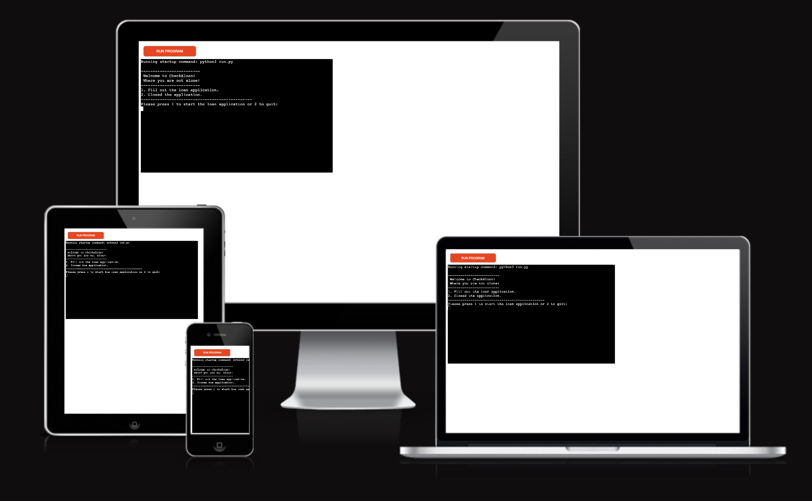

# CheckAloan

Checkaloan is aPython terminal-based application that evaluates the loan eligibility of a user.  The app calculates a score and interest rate based on the user's input and provides a final decision on the loan approval.  The app runs on Heroku.

[Here is the live version of my project](https://checkaloan-cdfe97fe02ce.herokuapp.com/)

## How to use

- The user provides personal and financial details such as income, expenses, age, marital status, etc.
- The app calculates the score and interest rate based on this information.
- Based on the calculated score, the app makes a final decision:
    - <bold>Approved</bold> if the user is eligible for the loan.
    - <bold>Rejected</bold> if the user is not eligible.

## Features

### Existing features

 - Option to start the application form or quit the app.

 - Accepts user inputs.
 - Add the user's data to the database after the final decision
 - Input validation and error-checking
    - The user must press 1 to start the application or press 2 to close it.  Other characters or no input will not be accepted.
    - String inputs like name and phone must meet a minimum or exact length requirement.
    - The email input must contain "@" and ".".
    - Integer inputs will raise an error if 0,a string or no data is entered.
    - If the input for age is less than 19, the loan application will be canceled,  and the user will be taken back to the welcome page.
    - The loan amount cannot exceed 20,000. If a higher amount is entered, the user will be notified  and can choose to proceed with the maximum amount or cancel the application.
    - The monthly payment cannot exceed the loan amount. The user will be asked to adjust  the monthly payment.
- Data maintaned in class instances. Except the welcome_message and applicant_details functions.  Those are handled outside of the class.
- **welcome_message** will greet the user and, based on the input, either start the application or close it.
- **applicant_details** will return the user inputs, which will be used to create a class object.
- **database** is an empty dictionary. The applications that reach the decision phase will be stored as integers.
- "

### Future Features

## Data Model

The features, scoring system,interest rate increase and criteria for the app were initially created in [excel](/docs/roadmap.xlsx).

## Testing

### Bugs

There was a logical error in the make_changes function, which allowed the loan amount to be set higher than 20,000. A while True loop was implemented to prevent this issue by continuously prompting the user to enter a lower amount. A similar bug occurred with the monthly payment, where users were able to set the monthly payment higher than the total loan amount. This was also resolved using a while True loop, ensuring that the monthly payment cannot exceed the loan amount and that the loan term does not exceed sixty months.

### Remaining Bugs

### Validator Testing

## Deployment

App deployed via [Heroku](https://dashboard.heroku.com/apps).