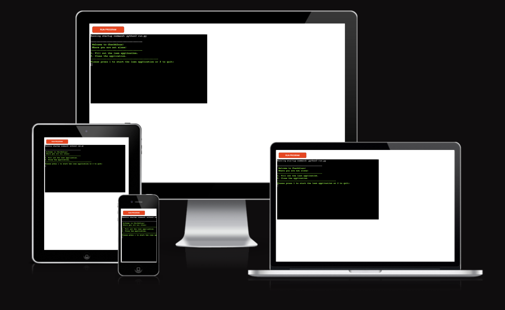
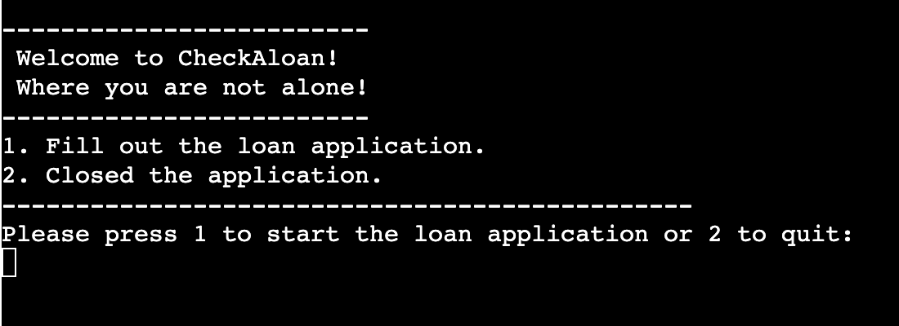
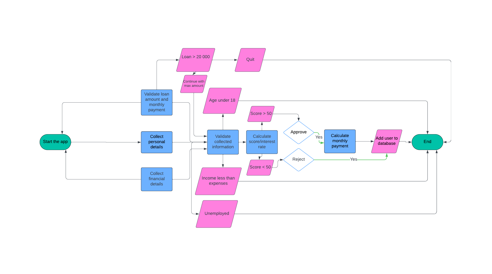

# CheckAloan

Checkaloan is aPython terminal-based application that evaluates the loan eligibility of a user.  The app calculates a score and interest rate based on the user's input and provides a final decision on the loan approval.  The app runs on Heroku.

[Here is the live version of my project](https://checkaloan-cdfe97fe02ce.herokuapp.com/)

## How to use

- The user provides personal and financial details such as income, expenses, age, marital status, etc.
- The app calculates the score and interest rate based on this information.
- Based on the calculated score, the app makes a final decision:
    - <bold>Approved</bold> if the user is eligible for the loan.
    - <bold>Rejected</bold> if the user is not eligible.

## Features

### Existing features

 - Option to start the application form or quit the app.

 - Accepts user inputs.
 - Add the user's data to the database after the final decision
 - Input validation and error-checking
    - The user must press 1 to start the application or press 2 to close it.  Other characters or no input will not be accepted. 
    
    - String inputs like name and phone must meet minimum/maximum length requirements. 
      - Name validation 
      - Phone number validation 
      - Marital status validation 
    - A robust email validation method was used for email input. 
    - Integer inputs will raise an error if 0, a string or no data is entered.
        - Number of dependent children 
        - Income/Expense validation 
    - If the input for age is less than 18 or more than 65, the loan application will be canceled,  and the user will be taken back to the welcome page.
        - Age between 18 - 65 
        - Age under 18 
        - Age over 65 
    - The loan amount cannot exceed 20,000. If a higher amount is entered, the user will be notified  and can choose to proceed with the maximum amount or cancel the application.
    - The monthly payment cannot exceed the loan amount. The user will be asked to adjust  the monthly payment.
- Data maintaned in class instances. Except the welcome_message and applicant_details functions.  Those are handled outside of the class.
- **welcome_message** will greet the user and, based on the input, either start the application or close it.
- **applicant_details** will return the user inputs, which will be used to create a class object.
- **database** is an empty dictionary. The applications that reach the decision phase will be stored as integers.

### Future Features

## Data Model

The features, scoring system,interest rate increase and criteria for the app were initially created in [excel](/docs/roadmap.xlsx).

To help visualize the structure and logic of the code, I have created a flowchart that outlines the main components and their interactions. 

The scoring and interest rate system can be found in the Excel sheet.

## Testing

### Bugs

There was a logical error in the make_changes function, which allowed the loan amount to be set higher than 20,000. A while True loop was implemented to prevent this issue by continuously prompting the user to enter a lower amount. A similar bug occurred with the monthly payment, where users were able to set the monthly payment higher than the total loan amount. This was also resolved using a while True loop, ensuring that the monthly payment cannot exceed the loan amount and that the loan term does not exceed sixty months.

### Remaining Bugs

No bugs remaining.

### Validator Testing

- PEP8 
    - No errors were returned from [PEP8](https://pep8ci.herokuapp.com/)

## Deployment

This project was deployed used Code Institute's mock terminal for [Heroku](https://dashboard.heroku.com/apps). 
Steps for deployment:
- Fork or clone the repository CheckAloan
- Create a new Heroku app 
- Set the buildbacks for **Python** and **NodeJS** in that order
- You must then create a Config Var called PORT. Set this to 8000
- Link the Heroku app to the repository
- Click on <strong>Deploy</strong>

### Local Development

#### How to Fork

To fork the CheckAloan repository:
  - Log in (or sign up) to Github.
  -  Go to the repository for this project, Tamas-Gavlider/CheckAloan.
  - Click the Fork button in the top right corner.

#### How to Clone

To clone the CheckAloan repository:

- Log in (or sign up) to Github.
- Go to the repository for this project, Tamas-Gavlider/CheckAloan.
- Click on the code button, select whether you would like to clone with HTTPS, SSH or GitHub CLI and copy the link shown.
- Open the terminal in your code editor and change the current working directory to the location you want to use for the cloned directory.
- Type 'git clone' into the terminal and then paste the link you copied in step 3. Press enter.

## Credits 

Code Institute for the deployment terminal and Readme template.

For unit testing, I utilized methods and examples from the following resources:
  - [andressa.dev](https://andressa.dev/2019-07-20-using-pach-to-test-inputs/) 
  - [sophieau.com](https://sophieau.com/article/python-in-out-err-mocking/) 
  - [python.org](https://docs.python.org/3/library/unittest.mock.html) 

These resources provided valuable insights into testing input handling and mocking techniques.

For email validation, I referenced the following resource to implement more complex checks beyond just "@" and ".":
- [javatpoint.com](https://www.javatpoint.com/how-to-validated-email-address-in-python-with-regular-expression.)
This resource helped in applying regular expressions for robust email validation.